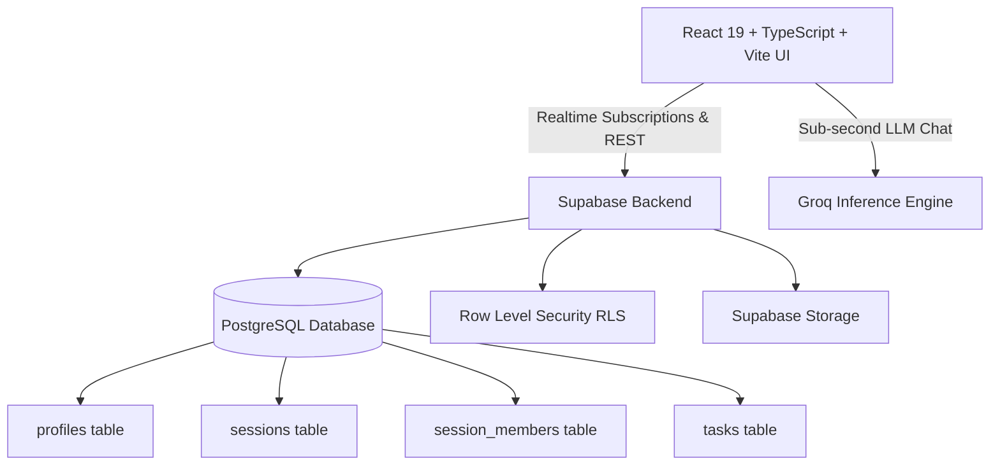

# 🎓 StudySpot — Next-Gen Campus Productivity & Spatial Coordination Platform

<div align="center">


**A high-performance, real-time campus coordination engine designed with Linear, Notion, and Apple Maps aesthetics.**

### 🌐 Live Platform URL: [https://github.com/git4ishaan/impromptu_hackathon](https://github.com/git4ishaan/impromptu_hackathon)
*(Deployable with 1-click on Vercel, Netlify, or Cloudflare Pages)*

</div>

---

## 💡 Overview

**StudySpot** solves the campus friction of finding active, focused study clusters and quiet study desks. Built specifically for university libraries and student commons, StudySpot blends **real-time spatial seat mapping**, **live acoustic & occupancy telemetry**, and an **LLM-powered Study Copilot** to give students a unified command center for campus productivity.

---

## 🌟 Key Product Features

### 1. 📊 Real-Time Campus Pulse & Acoustic Telemetry
- **Live Occupancy Tracking**: SVG progress radial displaying real-time library floor density.
- **Acoustic Decibel Monitoring**: Real-time noise metrics per floor:
  - `Floor 1`: Collaborative Commons • **42 dB** (Moderate)
  - `Floor 2`: Silent Reading Deck • **18 dB** (Whisper Quiet)
  - `Floor 3`: Engineering Wing • **28 dB** (Quiet)
  - `Floor 4`: Research Desks • **20 dB** (Ultra Quiet)
- **Campus Velocity Counters**: Live sync count of active students across all zones.

### 2. ⚡ Linear-Style Live Group Discovery
- **Dynamic Session Feed**: Filterable by subject categories (*Programming*, *Mathematics*, *Projects*, *Exam Prep*).
- **Session Cards**: Displays host credentials, exact floor location, live elapsed time counter, and instant room entry.
- **Access Control Modes**: Public instant-join or Private host-approval rooms.

### 3. 🗺️ Spatial Campus Navigation (SeatMapper)
- **Blueprint Mapping**: Interactive library floor plan switcher (`F1` to `F4`) with zoom in, zoom out, and reset controls.
- **Live Pin Telemetry**: Glowing coordinate markers with hover cards indicating zone acoustics, desk capacity, and host details.
- **Zone Inspection**: Inspect seating coordinates and noise levels before walking to the desk.

### 4. 🤖 StudySpot AI Copilot & Live AI Tutor
- **Campus Copilot**: Guides students to open study spots and subject groups using real-time database context.
- **In-Session AI Tutor**: Context-aware AI tutor powered by Groq's low-latency inference engine (`groq/compound-mini`).
- **Interactive Prompts**: One-click generation of study roadmaps, concept breakdowns, practice exam questions, and summary briefs.

### 5. 🛠️ Collaborative Live Workspaces
- **Real-Time Task Checklists**: Shared goal management with animated progress bars and live completion syncing.
- **Participant Roster**: Live student presence indicators with host moderation (approve requests, kick users).
- **Document Stash & Scanner**: In-browser text extraction for `.pdf`, `.docx`, and `.txt` files feeding directly into the AI tutor's context.

---

## 🏗️ Architecture & Technology Stack



- **Frontend**: React 19, TypeScript, Tailwind CSS v4, Framer Motion, Lucide Icons, PDF.js, Mammoth.
- **Backend & Database**: Supabase (PostgreSQL, Realtime WebSockets, Row Level Security, Auth, Storage).
- **AI / LLM Engine**: Groq High-Speed Inference (`groq/compound-mini`).

---

## 🔐 Security & Row Level Security (RLS)

All database operations are governed by strict PostgreSQL Row Level Security policies:

| Table | SELECT | INSERT | UPDATE | DELETE |
| :--- | :--- | :--- | :--- | :--- |
| `profiles` | Public (`true`) | Authenticated Self | Authenticated Self | Self |
| `sessions` | Public (`true`) | Authenticated User | Host Only | Host Only |
| `session_members` | Public (`true`) | Authenticated Self | Host Only | Host or Member |
| `tasks` | Public (`true`) | Host or Approved Member | Host or Approved Member | Host or Approved Member |

---

## 🚀 Getting Started

### 1. Clone the Repository
```bash
git clone https://github.com/git4ishaan/impromptu_hackathon.git
cd impromptu_hackathon
npm install
```

### 2. Configure Environment Variables
Create a `.env.local` file in the project root:
```env
# Supabase Configuration
VITE_SUPABASE_URL=https://your-project.supabase.co
VITE_SUPABASE_ANON_KEY=your-supabase-anon-key

# Groq AI Key Configuration
VITE_RANDOM_HACK_KEY=gsk_your_groq_api_key
```

### 3. Apply Database Migration
Execute the master SQL schema in your Supabase SQL Editor:
- Location: [`supabase/migrations/00000_master_schema.sql`](supabase/migrations/00000_master_schema.sql)

### 4. Start Development Server
```bash
npm run dev
```

### 5. Production Build & Linting
```bash
npm run lint   # 0 errors, 0 warnings
npm run build  # Optimized production bundle
```

---

## 👨‍💻 Author & Acknowledgements

- **Created by**: Ishaan Patil ([@git4ishaan](https://github.com/git4ishaan))
- **Built for**: MIT-WPU Hackathon 2026
- **License**: MIT
